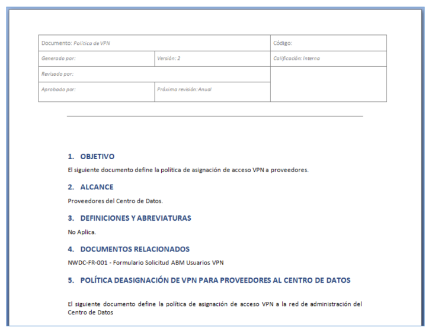

# Actividad 3. Política de seguridad VPN proveedores

Considerando que Ud. es el Responsable de Seguridad Informática de la Entidad Alfa, diseñe una Política de
Seguridad para el control de acceso remoto de proveedores.

- Recuerde qué generalmente una política incluye:
  - Objetivos
  - Alcance
  - Documentos relacionados
  - Definiciones y abreviaturas
  - Versionado y control de cambios
- Sobre el acceso remoto y proveedores
  - Asignación (criterios)
  - Nomenclatura
  - Tiempo de vida
  - Acceso a recursos
  - Perfiles
  - Auditoria

### Solución:

_encabezado_

### ¿Alfa a que se dedica? ¿Está regulada? ¿Qué requerimientos internos hay?

#### _`Objetivo`_ / _`Alcance`_

#### Documentos relacionados:

- FORM-AccesoRemoto-01.docx
- Pol-SI-001.docx

#### Definiciones y abreviaturas:

- VPN
- Acceso remoto: la definición,
- MFA

#### Política de asignación de VPN para proveedores:

- No se brindará acceso VPN a menos que el mismo sea estrictamente necesario
- El acceso VPN será brindado a proveedores que excepcionalmente deban realizar tareas de forma remota durante un periodo acotado y definido expresamente
- La solicitud deberá realizarse formalmente al área de Accesos, permisos y usuarios (Gerencia de SI) y supervisado por el área de GRC
- El acceso VPN será brindado de manera individual al personal proveedor que sea designado para realizar las tareas en forma remota
- No se utilizaran para los accesos VPN cuentas genéricas, sino que deberán estar asociadas a una persona física y fácilmente identificables al proveedor
  - Proveedor_InicialNombre_Apellido
  - Ext_inicialnombre_Apellido
  - Legajo 78788888
- Los permisos de acceso se basaran en perfiles acorde al trabajo a realizar, sosteniendo el principio de mínimo privilegio
- El acceso VPN será brindado a través de la implementación de MFA
- No se brindará acceso a recursos corporativos de ALFA a través de la VPN
- El acceso VPN deberá acotarse a la franja horaria laboral de ALFA, salvo autorización expresa de las Gerencias involucradas. En caso contrario la misma será revocada
- El proveedor no podrá realizar actividades o ejecutar herramientas que comprometan la infraestructura e información de la organización
- La conexión será bloqueada luego de 10 minutos de inactividad
- El acceso se encontrará restringido por zona geográfica, salvo autorización expresa o casos especiales
- El área de SI realizará monitoreos sobre las conexiones a fin de identificar y prevenir actividades maliciosas o sospechosas
- El acceso será otorgado cuando el equipo (host/computadora del proveedor) cumpla con los siguientes requisitos
  - Utilizar una imagen homologada por ALFA
  - Contar con una solución de antivirus actualizada (no más de 30 días)
- No se permitirán conexiones concurrentes
- Para el proceso de enrolamiento y comunicación de credenciales será realizado de manera presencial. En caso de poder realizarse de esta manera, las mismas serán enviadas en forma cifrada mediante la utilización de llaves públicas-privadas
- Para los casos particulares que no se puedan cumplir con los presentes controles o requieran configuraciones especiales, se realizarán los análisis
  pertinentes, se documentaran y solicitaran las aprobaciones correspondientes
- Mensualmente el área de Acceso, permisos y usuario realizara un control sobre los usuarios con acceso VPN
- En caso de incumplimiento o de detectarse un mal uso del recurso brindado se procederá a realizar el bloqueo del acceso y se elevará para su
  estudio
