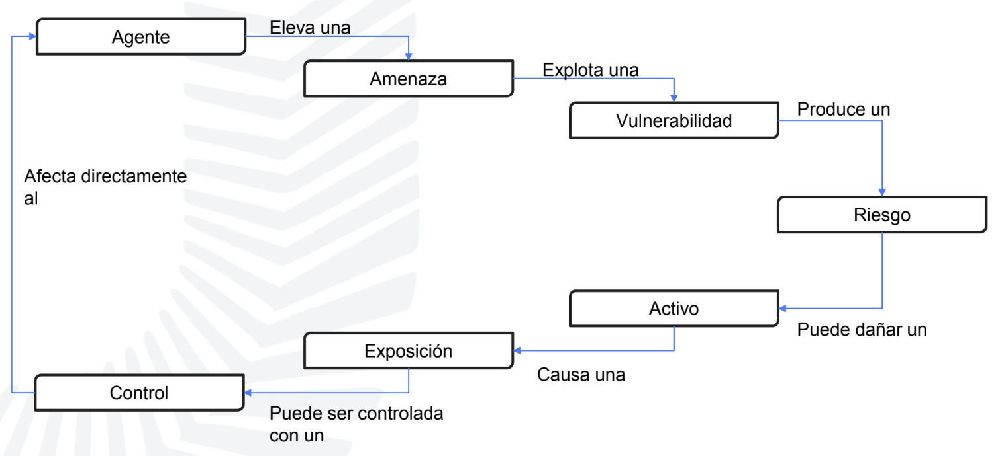

# Conceptos importantes

#### _Privacidad_:

- Determina el nivel de confidencialidad y protección que se le brinda a un usuario dentro de un sistema.
- Se refiere a la protección de los datos personales.

#### _Responsabilidad_:

- Habilidad para identificar las acciones individuales de un usuario dentro de un sistema. Permite obtener una trazabilidad.

#### _Autenticación_:

- Comprobación de las credenciales recibidas con el objetivo de determinar si un usuario es quien dice ser.

#### _No repudio_:

- Mecanismos por medio de los cuales la persona que realizó una acción, no puede negar haberla realizado (Ej. Si recibió un correo, no puede decir que no lo recbió).
- Utilización de elementos de información única permite validarla autenticidad de una persona.

#### _Separación de tareas_:

- La finalidad es separar al ente controlador sobre una acción, del ente ejecutor.
- Difusión de tareas y procesos para evitar conflicto de intereses.

  - Separar:
    1. Desarrollo de producción.
    1. Seguridad de Auditoría.
    1. Cuentas a cobrar de cuentas a pagar.
  - Conocimiento distribuido:
    1. claves de cifrado en dos componentes.

#### _Mínimo privilegio_:

- Cualquier objeto debe tener el mínimo privilegio necesario y posible para realizar la tarea que le corresponde.
- Limita la exposición de ataques (Superficie de ataque).

_ciclo de control amenaza_

#### _Agente_:

- Individuo o grupo _Que puede llevar a cabo_ una _Amenaza_.

#### _Amenaza_:

- Presencia de un evento que pueda impactar en forma negativa en una organización.

#### _Vulnerabilidad_:

- Ausencia o debilidad de un `Control`.

#### _Riesgo_:

- Probabilidad de que la amenaza **explote** una _vulnerabilidad_ causando pérdidas y daños a los activos e impacte en el negocio.

#### _Activo_:

- Recurso, producto, proceso, dato o todo aquello que tenga valor para el negocio de la organización.

#### _Control_:

- Tiene la función de reducir el _riesgo_ asociado con una _amenaza_ o grupo de amenazas.
