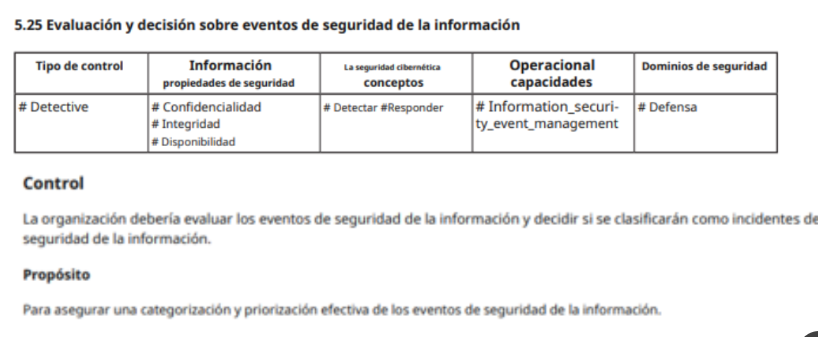
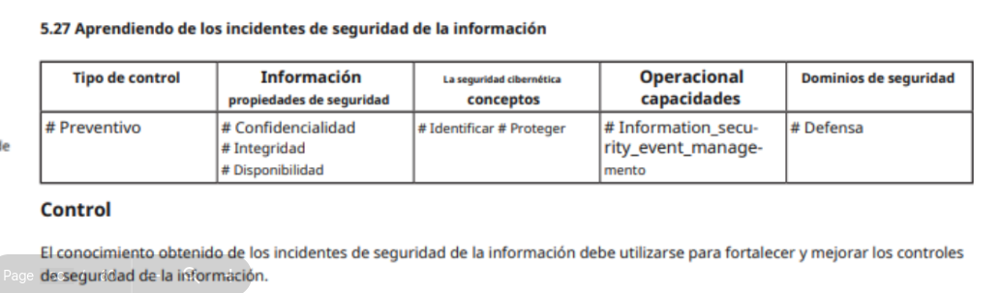
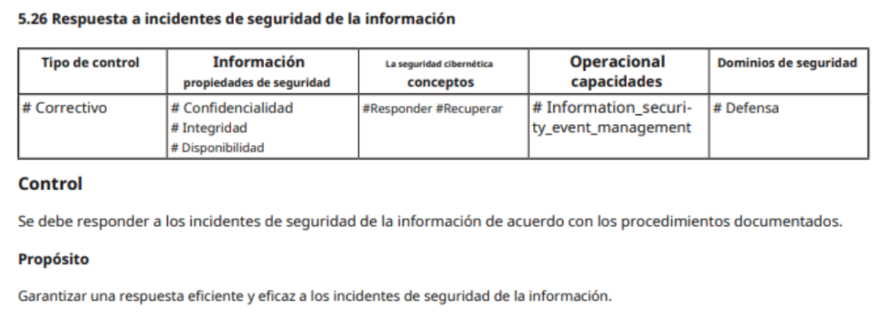
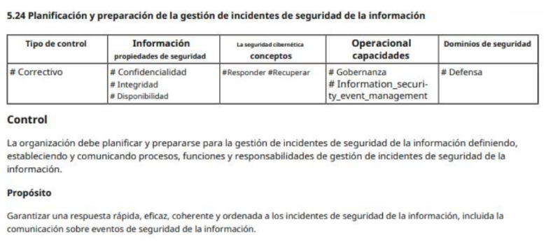

# Políticas

### _Alta gerencia_:

`Declaración administrativa de alto nivel sobre los objetivos de seguridad de una organización, la responsabilidad individual, organizativa, la ética, los controles y requisitos generales.`

### _Regulatorias_:

`Políticas altamente detalladas y concisas generalmente exigidas por requisitos estatales, de la industria u otros requisitos legales.`

### _No mandatorias_:

`No mandatorias, pero muy recomendadas, a menudo con sanciones o consecuencias específicas por incumplimiento`

### _Informativas_:

`Solo informa, sin requisitos explícitos de cumplimiento`

---

## Contenido

- [x] Definiciones de seguridad, objetivos y alcance.
- [x] Responsabilidades.
- [x] Documentación de respaldo.
- [x] Principios o requerimientos a cumplir.

#### _Ejemplo_:

Lineamientos:

- La información, en cualquiera de los formatos que se encuentre, se considera
  como un bien de gran valor para la organización y los Sistemas de Información
  son activos críticos para la Organización.
- La información debe ser protegida de una manera adecuada a sus sensibilidad.
- La Organización declara su decisión de cumplir con la normativa y legislación
  vigente en temas de Seguridad de la Información.
- La S.I. es responsabilidad de todos.
- Todo empleado debe acceder exclusivamente a la información que le sea
  estrictamente necesaria.

