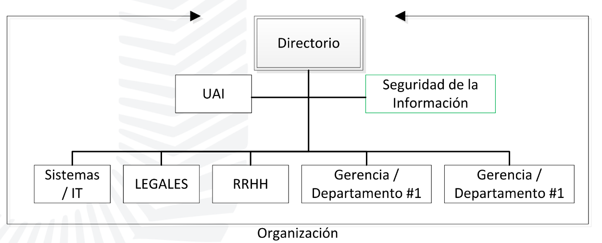

# Roles y responsabilidades

_diagrama gerarquico de la organización_

### <u>Otros términos comunes</u>:

#### _Gerencia general / directorio_:

- Responsable final por la seguridad de la información.

#### _CISO_ (Chief information security officer):

- Responsable funcional por la seguridad de la información.

#### _CSO_ (Chief security officer):

- Responsable último de la seguridad de la información.

\*(COO, CTO, CIO, CEO, BISO)

#### _Dueño_ (Owner):

- Determina el nivel de clasificación de la información.

#### _Custodio_:

- Preserva la **Confidencialidad**, **Integridad** y **Disponibilidad** de la información.

#### _Auditor_:

- Evalúa los controles de seguridad y presenta recomendaciones a la Gerencia General / Alta gerencia / Directorio.
