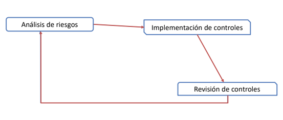

# Gestión de riesgo

### _Administración de riesgos:_

- Es un **proceso** de `Identificación`, `Análisis` y `Determinación` de riesgos.
- Su principal objetivo es **mitigar el riesgo**. Es decir, reducir el riesgo a un nivel tolerable/aceptable para la organización.

### _Análisis de riesgos:_

- El análisis de riesgos comprende la identificación, y evaluación de `AMENAZAS` y `VULNERABILIDADES` que afectan a los activos de una organización, estimando el riesgo al que se encuentran expuestos dichos activos.

#### _Ciclo de gestión del riesgo:_

