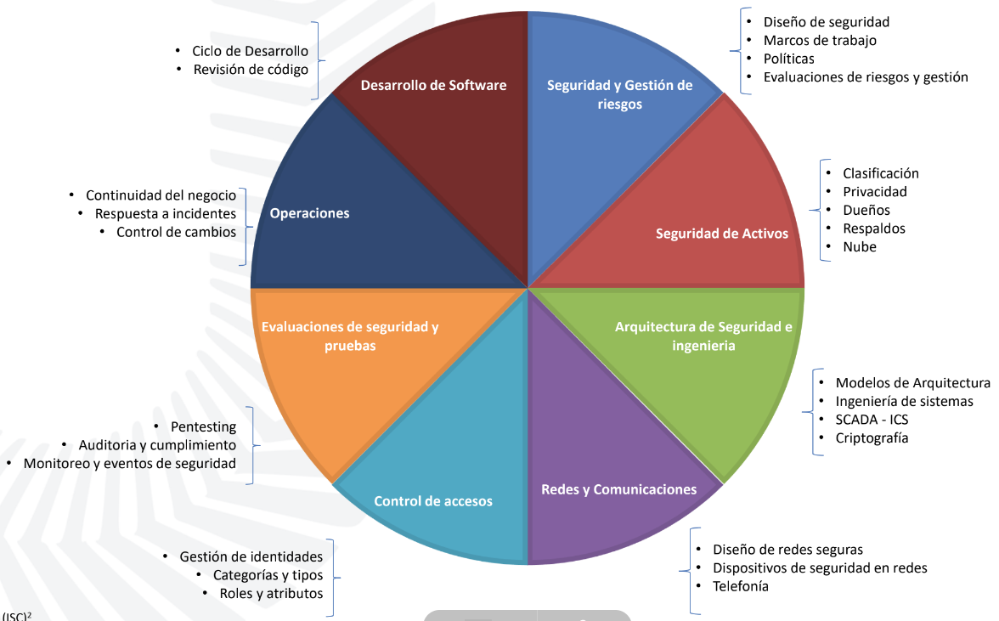

# Controles de seguridad

- Reducción de los efectos producidos por las amenazas de seguridad y vulnerabilidades a un nivel tolerable pro la organización.

- Clasificación:
  - Por momento de acción:
    1. Preventivos
    1. Detectivos
    1. Correctivos
  - Por modo de acción:
    1. Físicos
    1. Técnicos
    1. Administrativos

_areas de aplicación de ciberseguridad_
