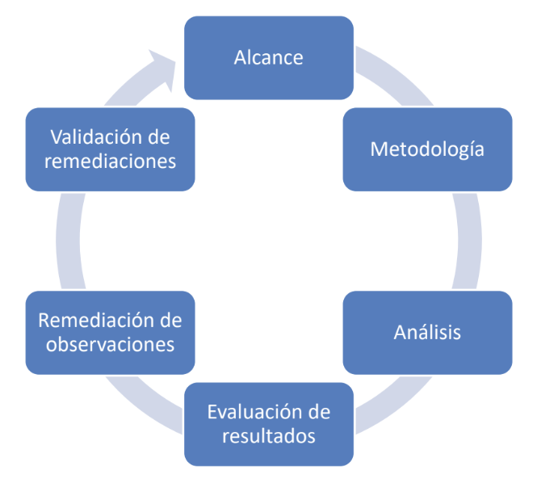

# Planificación y metodología

### Que **`NO`** hace un proyecto de este tipo:

1. Conseguir **todas** las vulnerabilidades.
1. Atacar **todas** las vulnerabilidades.
1. **Corregir** las vulnerabilidades.

### Que **`NO`** hace un pentester:

1. **No** respetar el alcance.
1. Actuar de forma **no ética**.
   - No reportar hallazgos.
   - No cumplir con leyes

### Planificación

