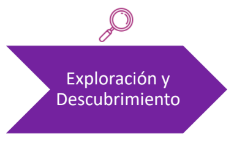

Etapa de recolección de información pública:

- Permite evaluar el nivel de visibilidad desde el exterior.
- Comprender el _core_ del objetivo (negocio, activos más valiosos, impacto posible).
- Delimitar las áreas de evaluación.
- Es la búsqueda de toda información relacionada con el objetivo.

### Ejemplos y procedimientos:

- Dirección física
- Números telefónicos
- Nombres de personas, empleados y cuentas de correo
- Información de la empresa
- Proveedores
- Nombres de dominio
- Rangos de direcciones de IP, ISP
- Aplicaciones publicadas
- Metadatos
- Identificación de sistemas activos
- Barrido de puertos
- Identificación de servicios
- Identificación de sistemas operativos
- Mapeo y delimitación:
  - Equipos de networking
  - Firewalls y VPN
  - Servidores de correo, DB, Web, etc...
