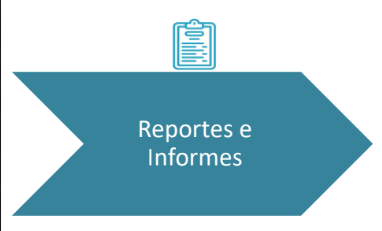

Etapa de consolidacióon de información y elaboración de los documentos entregables

- Informe ejecutivo (alto nivel, repercución económica, discurso adaptado a nivel gerárquico de la empresa)
- Informe técnico

### Ejemplos y procedimientos:

- Claridad y objetividad
- Bitácora - reportes
- Fortalezas -debilidades
- Diagnóstico - recomendaciones
- Gráficos de apoyo
- Evidencia
- Descripción
- Criticidad
- Recomendación / remediación
