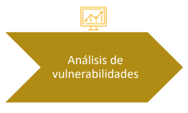

Etapa de análisis de los datos encontrados para la detección y determinación de vulnerabilidades.

- Análisis funcionales para la detección de vulnerabilidades en los procesos.
- Vulnerabilidad técnica, vulnerabilidad funcional
- Automático / Manual

### Ejemplos y procedimientos:

- Elaborar un plan de pruebas
- Buscar en bases de conocimiento las vulnerabilidades asociadas (CVE / CVSS)
- Evaluación del nivel de seguridad y vulnerabilidades
- Enumeración de usuarios
- Datos de configuración
- Instalaciones Demo, o por defecto
- Esquemas de autenticación y control de acceso
- Web:
  - Documentación
  - Configuración
  - Análisis técnico
  - Manejo de datos y errores
  - Concurrencia, navegación.

---

### Ejemplo

- **`Activo`**: Datos de clientes
- **`Vulnerabilidad`**: SQL injection
- **`Amenaza`**: Robo de información (information disclosure)
