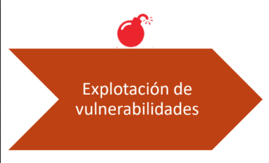

Etapa de explotación de las vulnerabilidades encontradas

- Explotación controlada
- Consolidación en los sistemas
- Denegación de servicio / Ejecución de código arbitratrio.

### Ejemplos y procedimientos:

- Elaborar un plan de pruebas
- Coordinado o no con el equipo según acuerdo (horarios de ataque, tipos de ataque permitidos)
- Ataques del lado del servidor
- Ataques del lado del cliente
- Consolidación:
  - Elevación de privilegios
  - Detección
