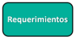

### Seguridad durante el análisis de requerimientos

- [x] Información de los usuarios => **Requerimientos de privacidad**
- [x] Riesgos innecesarios => **Requerimientos arbitrarios**
- [x] ¿Qué estamos defendiendo? => **Clasificación de activos**
- [x] ¿Qué nos pueden hacer? => **Casos de abuso**
- [x] ¿Cómo nos defendemos? => **Requerimientos de seguridad**
- [x] ¿Que llegamos a hacer? => **Priorización de requerimientos**
