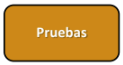

### Etapa de pruebas:

- [x] Comienzo temprano de las pruebas
- [x] Revisión de cóidigo entre pares
- [x] Análisis estático: IDE / Intérprete / Framework
- [x] Pruebas de penetración
- [x] Auditorías de código
