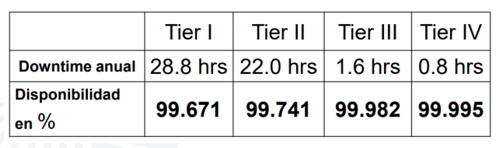

# Centros de Datos

## Se clasifican según Tiers:

### TIER 1: Infraestructura básica

- Componente no redundantes
- Única vía de distrubución no redundante
- Una falla en un componente o en la distrubución impactará en el funcionamiento de los sistemas de cómputo
- Infraestructura susceptible a interrupciones por cualquier evento planeado o no planeado
- Aplica para:
  1. Organizaciones pequeñas
  1. Infraestructura de TI solo para procesos internos
  1. No requiere QoS (Quality of Service)

### TIER 2: Infraestructura con componentes redundantes

- Hardware redundante
- Única vía de distrubución no redundante
- Infraestructura susceptible a interrupciones por cualquier evento planeado o no planeado
- UPS y generador redundantes
- Aplica para:
  1. Organizaciones pequeñas
  1. No requiere online - realtime
  1. No requiere QoS (Quality of Service)

### TIER 3: Infraestructura con mantenimiento simultaneo

- Componentes redundantes
- Vías de distribución redundante (una activa, resto pasivas)
- Los componentes pueden ser removidos durante un evento planeado sin generar interrupciones en el sistema
- Infraestructura susceptible a interrupciones por evento no planeado
- Riesgo de interrupción durante mantenimientos
- Aplica para:
  1. Organizaciones con servicio 7x24
  1. Organizaciones de TI da soporte a procesos automatizados
  1. Requiere QoS (Quality of Service)

### TIER 4: Infraestructura tolerante a fallas

- Componentes redundantes
- Múltiples vías de distribución activas y redundantes
- Los componentes pueden ser removidos durante un evento planeado sin generar interrupciones en el sistema
- No susceptible a interrupciones por evento no planeado
- Posibles causas de interrupción:
  1. Alarma de incendio
  1. Supreción de incendio
  1. Emergency power off
- Aplica para:
  1. Organizaciones con pisad internacional
  1. Organizaciones con servicio 24x365
  1. Procesos y transacciones online
  1. Requiere QoS (Quality of Service)

#### Uptime institute (Anual downtime table)

