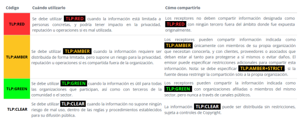

# Etapas en la gestión de incidentes

### `Preparación`:

- Fase de preparación para entender el incidente

### `Identificación`:

- Detección del incidente

### `Contención`:

- Medidas para limitar y aislar el impacto de incidente

### `Remedicación`:

- Medidas para eliminar la amenaza

### `Recuperación`:

- Procedimientos para volver a una operatoria normal

### `Actividades Post-Incidentes`:

- Identificar e implementar medidas de mejora

---

## Los incidentes deben:

1. Clasificarse
1. Priorizarse
1. Gestionarse

## Los incidentes tienen:

1. Estado (abierto, cerrado, pendiente...)
1. Seguimiento
1. Asignación
1. Formade identificarse (id, #, etc...)
1. Evidencia

### Cooperación y comunicación

### Madurez:

- Adoptar una metodología para conocer el estado de madurez
- Ejemplo: SIM3, Security Incident Manager Maturity Model

- Security.txt
